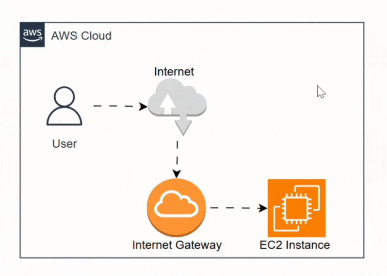

# Day 1 — Connect to Amazon EC2 via SSH

This guide captures the steps I used to SSH into an EC2 instance on Day 1 of my AWS architecture learning. It assumes a basic Linux EC2 instance using a public IPv4 address and an associated key pair.



## Prerequisites

- AWS account with an EC2 instance running (Amazon Linux or Ubuntu)
- Key pair (`.pem`) downloaded from EC2 at launch
- Instance security group allows inbound SSH on port 22 from my IP
- Public IPv4 address (or Elastic IP) for the instance
- SSH client installed (PowerShell/OpenSSH on Windows, or any terminal on macOS/Linux)

## Steps (Windows with PowerShell/OpenSSH)

1) Place the `.pem` key somewhere safe (e.g., `C:\keys\my-key.pem`).
2) Fix permissions so only my user can read the key:

```powershell
icacls "C:\keys\my-key.pem" /inheritance:r /grant:r "$($env:USERNAME):(R)"
```

3) Note the instance public IP from the EC2 console (e.g., `3.125.45.10`).
4) SSH into the instance using the right default user:

- Amazon Linux 2: `ec2-user`
- Ubuntu: `ubuntu`

```powershell
ssh -i "C:\keys\my-key.pem" ec2-user@3.125.45.10
```

5) On first connect, accept the host key prompt to add the fingerprint to `known_hosts`.


## Quick sanity checks after login

- `whoami` to confirm the user
- `uname -a` to see OS details
- `sudo yum update -y` (Amazon Linux) or `sudo apt update && sudo apt upgrade -y` (Ubuntu) if I want latest packages

## Common connection errors and fixes

- **Permission denied (publickey)**: Wrong username or key permissions not restricted. Re-run `icacls`/`chmod` and use the correct default user.
- **Timed out**: Security group missing inbound port 22 from my IP, or instance not in `running` state.
- **Host key changed warning**: Possibly IP reassigned to a different instance; verify in AWS console before clearing the old entry in `~/.ssh/known_hosts`.

## Next steps

- Attach an Elastic IP to keep the address stable.
- Create a new user and disable direct root login via SSH.
- Set up AWS Systems Manager Session Manager for keyless access.
