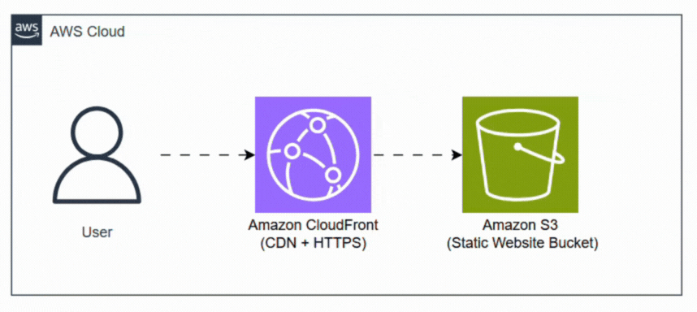

# Day 2 — Host a Static Website on S3 via CloudFront

This guide captures how I hosted a static website on Amazon S3 and delivered it globally via Amazon CloudFront (CDN + HTTPS). It uses an S3 static website endpoint as the origin for CloudFront.



## Prerequisites

- AWS account with permissions for S3 and CloudFront
- A unique S3 bucket name in the chosen region (e.g., `my-website-bucket`)
- Static site files ready (e.g., `index.html`, `styles.css`, assets)
- Optional: a custom domain and ACM certificate for HTTPS on CloudFront

## Steps — S3 Static Website

1) Create an S3 bucket in the desired region (e.g., `us-east-1`).
2) Upload your site files (HTML/CSS/JS/assets) to the bucket.
3) Enable “Static website hosting” in the bucket Properties:
	- Index document: `index.html`
	- Error document: `error.html` (optional)
4) Make content publicly readable for website hosting:
	- Keep “Block Public Access” off for this bucket.
	- Add a bucket policy allowing public `s3:GetObject` (for website origin usage).
5) Note the S3 Website Endpoint shown in the Console (format below).

Example S3 Website URL format:
```
http://<bucket-name>.s3-website-<region>.amazonaws.com
```

## Steps — CloudFront Distribution

1) Create a CloudFront distribution.
2) Origin domain: select/paste the S3 Website Endpoint (not the REST bucket endpoint).
3) Default behavior:
	- Viewer protocol: Redirect HTTP to HTTPS
	- Cache policy: `CachingOptimized` (or custom as needed)
	- Allowed HTTP methods: GET, HEAD (typical for static websites)
4) Set “Default root object” to `index.html`.
5) If using a custom domain: attach ACM certificate and add the domain under “Alternate domain names (CNAMEs)”.
6) Create the distribution and wait for deployment.

## URLs

- S3 Website URL: http://gym-static-webproject-nitish.s3-website.ap-south-1.amazonaws.com/

- CloudFront URL: https://d1dnwdp8sgoruv.cloudfront.net/
  

## Quick checks

- Open both URLs in a browser; confirm the site loads.
- Use `Ctrl+F5` or CloudFront invalidations if changes don’t appear.

## Common issues and fixes

- **403 AccessDenied on S3 website URL**: Missing public-read bucket policy or “Static website hosting” not enabled.
- **404 Not Found**: `index.html` isn’t present or wrong “Default root object” on CloudFront.
- **CloudFront shows stale content**: Create an invalidation for `/*` or specific paths.
- **Mixed content warnings**: Ensure assets use `https` URLs when served via CloudFront.

## Next steps

- Attach a custom domain via Route 53 and enable HTTPS with ACM.
- Add CloudFront security headers and compression.
- Consider migrating to Origin Access Control (OAC) with S3 REST endpoint to avoid public bucket access.

