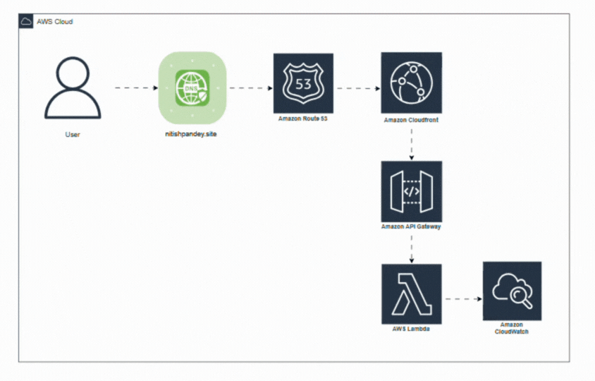

# AWS Cloud Architecture – Day 3 | Serverless Portfolio Architecture



## Overview
Today I worked on designing and deploying the serverless architecture of my personal portfolio, focusing on how real-world traffic flows through AWS managed services.

## 🔹 What I Built
I implemented and documented the architecture for my portfolio using a custom domain:

**🌐 nitishpandey.site**

## 🏗️ Architecture Flow
```
User → Custom Domain → Route 53 → CloudFront → API Gateway → Lambda → CloudWatch
```

## 🛠️ Services Involved
| Service | Purpose |
|---------|---------|
| **Custom Domain** | nitishpandey.site |
| **Route 53** | DNS routing |
| **CloudFront** | CDN for performance & HTTPS |
| **API Gateway** | Request handling |
| **Lambda** | Serverless backend logic |
| **CloudWatch** | Logs & monitoring |

## 🧠 Key Learnings
- How a custom domain integrates with API Gateway
- Why CloudFront is used in front of API Gateway for better performance and security
- How Lambda executions are logged in CloudWatch for observability
- Understanding the end-to-end request flow instead of treating services in isolation
- How production-ready serverless applications are structured on AWS

## 📐 Architecture Design
- Designed using draw.io
- Learning approach: **Build → Visualize → Understand**
